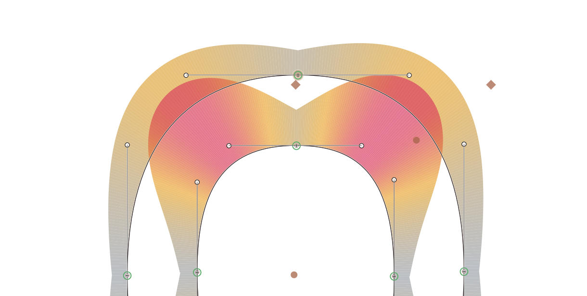

This repository hosts Yanone’s popular curvature illustration plug-in for [Glyphs.app](https://glyphsapp.com) and [RoboFont](https://robofont.com).

# Speed Punk

Speed Punk is a learning tool. It teaches you to better understand the nature of Bézier curves and their curvature, the technical basis of digital type design.

Speed Punk illustrates the curvature on top of the outlines with shapes that stand perpendicular on the outline. This is a technique commonly known from CAD software. The “bigger” the illustration is (the further away from the outline), the higher the curvature is at this point. This way it is easy to judge curvature continuity at on-curve points: if the illustrations are of same distance from the on-curve point (they “meet”), the two curves are of continuous curvature. If you see a jump in the curvature illustration, curvature is discontinuous. Simple. Mathematically speaking the curvature is the first derivative of the curve’s direction and it is being calculated using the general cubic Bézier equation.

The Bézier curve was developed almost simultaneously by two Frenchmen working in computer aided design (CAD) in the French automobile industry in the early 1960s, Paul de Casteljau working for Citroën and Pierre Bézier working for Renault. De Casteljau is today attributed with the invention, but Citroën decided to keep his research secret until the late ’60s, hence they carry Bézier’s name.
The curves play an important role in many areas of industrial design, namely aqua- and aerodynamics, as well as computer animation (smoothly controlling the velocity of an object over time). And of course computer graphics in general and type design in particular, as they provide a memory efficient means of storing illustrations and can easily be scaled and rasterized on the fly for sharp printing on output devices with varying resolutions.

*»If you ever have to make a case for redesign, I’ve found Speed Punk a helpful tool in explaining drawing quality to non-designery people. It makes quick and easy infographics so you show clients why their old art sucks and your new art rules.«* — Jackson Cavanaugh, Okay Type

*»Useful and pretty – a rare combination.«* — Hrant Papazian

*»Well, you don’t strictly need it. It’s just an analysis tool that amplifies and illuminates what is happening in your curves, particularly continuity at the junction of curve segments, making it easier to see where adjustments may be needed. It’s a way of seeing if your curves are really as smooth as you think they are.«* — Mark Simonson

# Installation

The plugins are installed through Glyphs.app’s built-in *Plugin Manager* or RoboFont’s *[Mechanic 2](https://robofontmechanic.com) Extension Manager*.

# How To Use

### Glyphs.app

The plug-in is activated in the View menu under *Show Speed Punk* or with the keyboard shortcut *Cmd+Shift+X*. The plug-in settings have moved into the context menu (right click).

### RoboFont

The plug-in is activated through the anarchy-icon in the toolbar.

# License

Formerly a commercial plug-in sold by Yanone, it is free & open source software as of December 2019 courtesy of Google Fonts, published under the **Apache 2.0** license.

# Contribution

I accept Pull Requests under the condition that utmost care is taken as to keeping the *speedpunklib* library for both Glyphs and RoboFont versions inside this repository identical.

# History

The plug in was first conceived during Yanone’s year at [Type & Media](http://typemedia.org) in 2010/11 at the KABK in Den Haag, where he learned about the math behind the Bézier curves.

It was publicly introduced during the Robothon 2012 conference in Den Haag, and sold there on CD and later by email before Yanone set up his online shop.

Meanwhile, the technology made it into the Fontlab 6 editor, and with [Supertool](http://www.corvelsoftware.co.uk/software/supertool/) a similar plug-in was first sold and later open sourced by Simon Cozens.

Given the free availability of similar plug-ins, especially with Supertool as a competition, Yanone ended up accepting Google Fonts’ offer to liberate the plug-in.